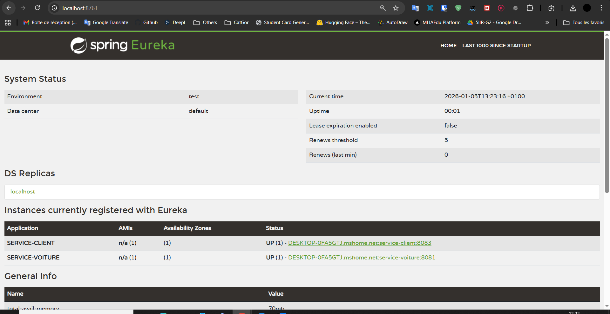
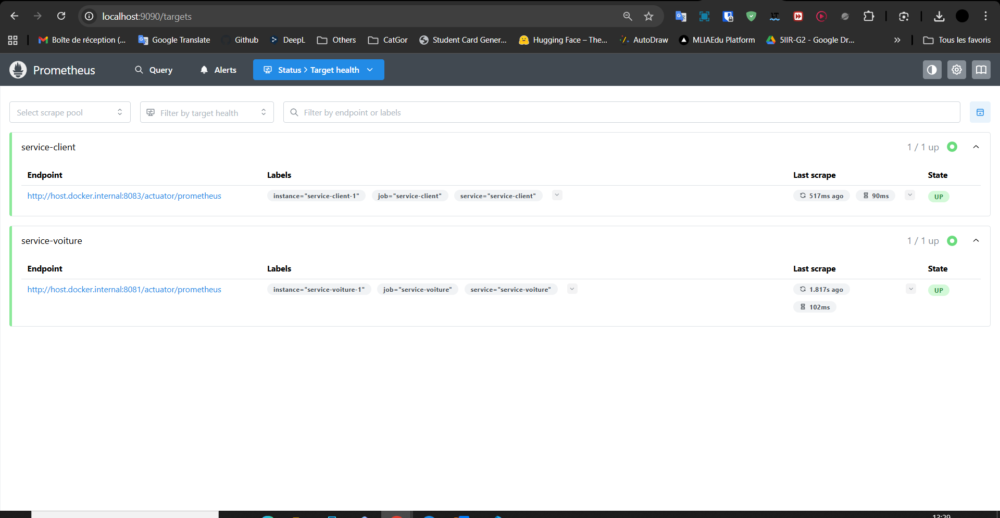
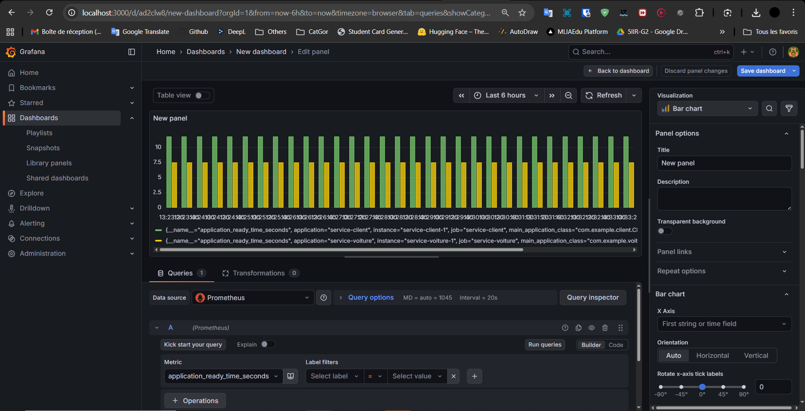

# 📋 ClientSynchrones - Travaux Pratiques

## 🎯 Objectif du TP

Ce projet vise à démontrer l'architecture d'une **application microservices distribuée** avec les composants suivants :

### Objectifs principaux :
1. **Comprendre les microservices** : Déployer et gérer plusieurs services Spring Boot indépendants
2. **Communication inter-services** : Utiliser OpenFeign pour appeler d'autres microservices
3. **Service Discovery** : Configurer Eureka et Consul pour l'enregistrement dynamique des services
4. **Monitoring & Observabilité** : Monitorer les services avec Prometheus et Grafana
5. **Orchestration** : Utiliser Docker Compose pour orchestrer tous les services

### Services inclus :
- **Eureka Server** : Service de découverte (port 8761)
- **Service Client** : Microservice client qui appelle le service voiture (port 8083)
- **Service Voiture** : Microservice exposant l'API des véhicules (port 8081)
- **Prometheus** : Collecte et stockage des métriques
- **Grafana** : Visualisation des métriques et dashboards

---

## 📊 Architecture et Flux de Données

### Image 1 : Architecture générale du système

---

### Image 2 : Flux de communication et monitoring

---

### Image 3 : Dashboard Grafana et indicateurs clés

---

## 📚 Technologies utilisées

| Technologie | Rôle |
|-------------|------|
| **Spring Boot 3.2.3** | Framework pour les microservices |
| **Spring Cloud Eureka** | Service Discovery |
| **OpenFeign** | Communication inter-services |
| **Micrometer + Prometheus** | Métriques et monitoring |
| **Prometheus** | Base de données temporelle pour les métriques |
| **Grafana** | Visualisation et dashboards |
| **Docker & Docker Compose** | Containerisation et orchestration |

---

## 📝 Conclusion

Ce TP démontre comment construire une architecture microservices complète avec :
- ✅ Services découplés et registrable via Eureka
- ✅ Communication inter-services via OpenFeign
- ✅ Monitoring complet avec Prometheus et Grafana
- ✅ Déploiement simplifié avec Docker Compose

